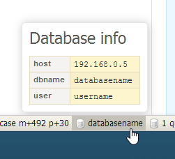

# pd/db-info-panel

Panel for Nette Debug bar which quickly tells you which database you use.

## Usage



## Install

The best way to install is using Composer:
`composer require pd/database-info-panel:@dev`

Another way is [download ZIP archive with last master](https://github.com/peckadesign/database-info-panel/archive/master.zip).

## Setup

Standard configuration with predefined DB name key:

```
parameters:
	database:
		host: 192.168.0.5
		dbname: databasename
		user: username
		password: abcdef

services:
	databaseInfoPanel:
		class: Pd\Diagnostics\DatabaseInfoPanel(%database%)

nette:
	debugger:
		bar:
			- @databaseInfoPanel
```

Standard configuration with predefined DB name key:
```
parameters:
	database:
		database: databasename

services:
	databaseInfoPanel:
		class: Pd\Diagnostics\DatabaseInfoPanel(%database%)
```

Configuration with custom DB name key:
```
parameters:
	database:
		myDbNameKey: databasename

services:
	databaseInfoPanel:
		class: Pd\Diagnostics\DatabaseInfoPanel(%database%, 'myDbNameKey')
```
